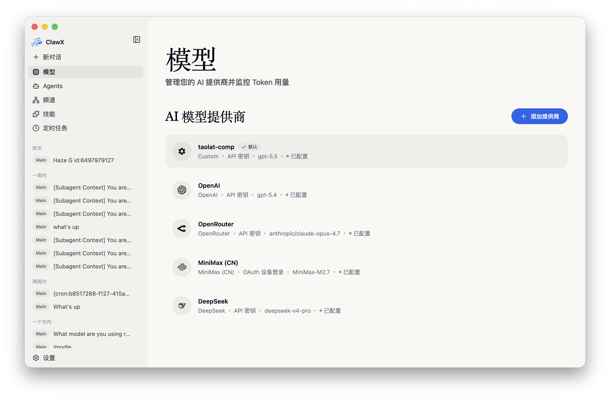
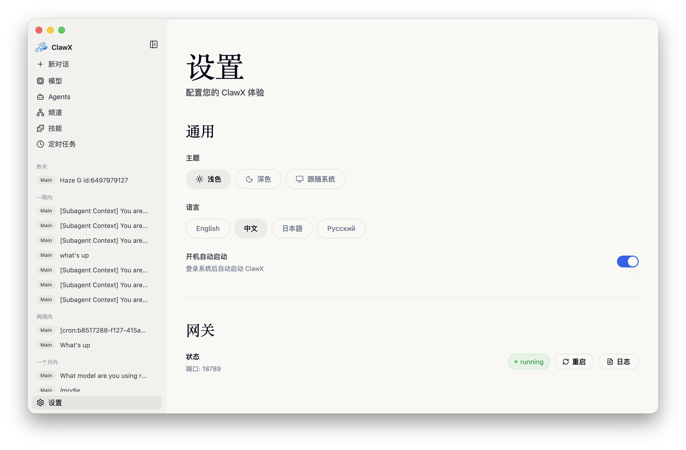
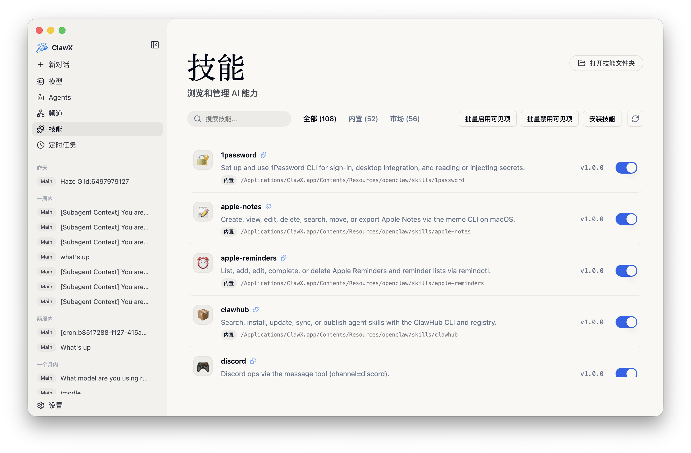

<p align="center">
  
</p>

<h1 align="center">ThingoClaw</h1>

<p align="center">
  <strong>基于 OpenClaw 的桌面 AI Agent 工作台</strong>
</p>

<p align="center">
  <a href="https://github.com/jolanisogilvi-spec/ThingoClaw/releases">
    
  </a>
  <a href="https://github.com/jolanisogilvi-spec/ThingoClaw/releases">
    
  </a>
  
  
</p>

## 项目简介

ThingoClaw 是一个 Electron 桌面应用，用图形化界面承载 OpenClaw AI Agent 运行时。它面向日常研发、文档处理、自动化任务和多模型协作场景，把对话、工具调用、技能管理、计划任务、模型配置和运行日志集中到一个本地桌面工作台中。

当前项目已经完成 ThingoClaw 运行时身份整理。新会话中的默认身份、系统上下文、OpenRouter 标题、Gateway 展示名、CLI 启动器和 Windows 安装包都以 ThingoClaw 为准；保留的旧内部命名仅用于兼容历史配置、插件 ID 和迁移逻辑。

## 下载与更新

当前发布渠道使用 GitHub Releases：

- 发布页：[jolanisogilvi-spec/ThingoClaw Releases](https://github.com/jolanisogilvi-spec/ThingoClaw/releases)
- Windows 安装包：`ThingoClaw-0.4.13-win-x64.exe`
- 更新源：GitHub Releases，仓库 `jolanisogilvi-spec/ThingoClaw`
- 更新方式：应用启动后按节流策略检查更新，发现新版本时先提示用户，由用户确认后再下载和安装

Windows 安装包以管理员权限安装。构建配置使用 `requireAdministrator` 和 NSIS per-machine 安装，适合需要写入系统安装目录或注册桌面入口的场景。

## 界面预览

<p align="center">
  
  
</p>

<p align="center">
  
  
</p>

## 核心能力

- 桌面化 OpenClaw：通过 Electron、React、Vite 和 TypeScript 提供本地 GUI。
- 多会话对话：管理 OpenClaw 会话、运行状态、工具调用和历史记录。
- Thingo AI 提供商：内置 `https://uniapi.thingo.com.cn/v1`，默认协议为 OpenAI Completions，默认模型为 `gpt-5.5`。
- 多模型配置：支持 OpenAI、OpenRouter、Claude、Gemini、Ollama、LM Studio、Custom 等提供商。
- 技能系统：内置文档、表格、演示文稿、PDF、搜索、自我改进 Agent 等技能入口。
- 计划任务：通过 Cron 页面管理定时任务和自动化执行。
- Channels 通道：支持扩展消息通道和外部集成。
- 模型用量统计：从 OpenClaw session transcript 的结构化 usage 记录中统计 token 与成本。
- 文件与文档能力：支持文档预览、文件附件、Office/PDF 工作流和本地素材引用。
- 更新与发布：使用 GitHub Releases 作为安装包和自动更新的唯一来源。

## 运行流程

ThingoClaw 的主流程由桌面壳、主进程代理、Gateway 和 OpenClaw runtime 组成：


渲染进程不直接访问 Gateway HTTP 接口，也不直接调用 Electron IPC。新的后端能力应通过 `src/lib/host-api.ts` 和 `src/lib/api-client.ts` 暴露，再由主进程统一处理传输、代理和回退逻辑。

## 系统要求

- Windows 10 或更高版本，推荐 Windows 11。
- Node.js 20 或更高版本。
- pnpm 使用 `package.json` 中 `packageManager` 字段锁定的版本。
- 如需实际调用模型，需要在设置页配置至少一个可用的 AI Provider API Key。

## 从源码运行

```powershell
corepack enable
corepack prepare
pnpm run init
pnpm dev
```

`pnpm run init` 会安装依赖，并下载运行所需的 uv 与 agent-browser 资源。开发模式下，Vite 和 Electron 会一起启动，OpenClaw Gateway 会在后台自动拉起，默认端口为 `18789`。

## 常用命令

| 任务 | 命令 |
| --- | --- |
| 安装依赖和运行资源 | `pnpm run init` |
| 启动开发环境 | `pnpm dev` |
| 类型检查 | `pnpm run typecheck` |
| 单元测试 | `pnpm test` |
| E2E 测试 | `pnpm run test:e2e` |
| 仅构建前端 | `pnpm run build:vite` |
| 构建 Windows 安装包 | `pnpm run package:win` |
| 通信回放验证 | `pnpm run comms:replay` |
| 通信基线对比 | `pnpm run comms:compare` |
| Harness 本地检查 | `pnpm run harness:ci` |

## Windows 发布构建

Windows 发布包推荐使用项目脚本构建：

```powershell
pnpm run package:win
```

该命令会准备 Windows 二进制资源，修补 NSIS 配置，并通过 Electron Builder 生成安装包。发布前应确认以下文件与 GitHub Release 同步：

- `ThingoClaw-<version>-win-x64.exe`
- `ThingoClaw-<version>-win-x64.exe.blockmap`
- `latest.yml`

自动更新依赖 `latest.yml` 和安装包资产，因此移动 tag、覆盖 Release 资产或重新构建安装包后，需要保证 Release 页面中的文件来自同一次构建。

## 配置与数据

ThingoClaw 不需要单独数据库。应用数据主要来自：

- Electron Store：保存桌面端设置。
- 系统钥匙串：保存敏感凭据。
- OpenClaw 配置目录：保存 agent、session、transcript 和 runtime 相关数据。
- 本地工作区：保存用户选择的项目文件和会话上下文。

默认身份文件会在首次启动时写入 ThingoClaw 身份。如果检测到旧版自动生成的默认身份，会自动迁移为 ThingoClaw；如果用户手动改写过身份文件，应用不会覆盖用户内容。

## 开发约定

- 用户可见文案需要走 `react-i18next`，并补齐 `en`、`zh`、`ja`、`ru` 语言文件。
- Renderer 新增后端调用必须通过 `host-api` 和 `api-client`。
- 涉及 Gateway、runtime、发送接收、回退或通信链路的改动，需要运行通信回放和对比检查。
- 涉及用户可见 UI 的改动，应补充或更新 Electron Playwright E2E 用例。
- 功能或架构变化后，需要同步检查 README 和相关文档。

## 许可证

本项目基于仓库中的许可证文件发布。使用、修改和分发前请先阅读对应许可证条款。
